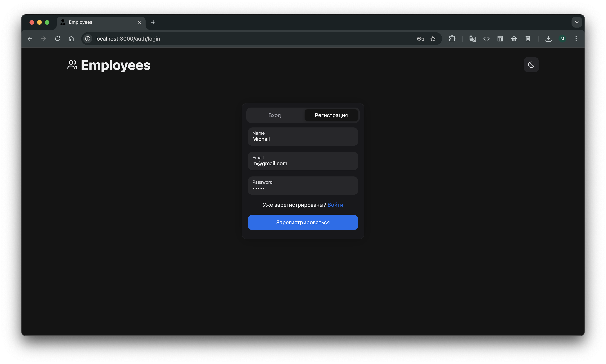
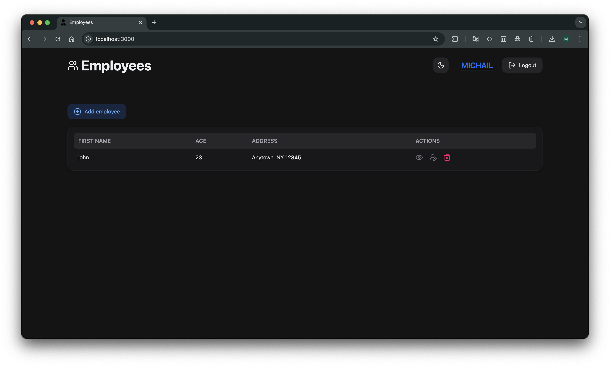
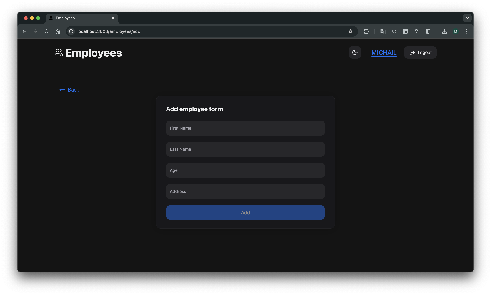
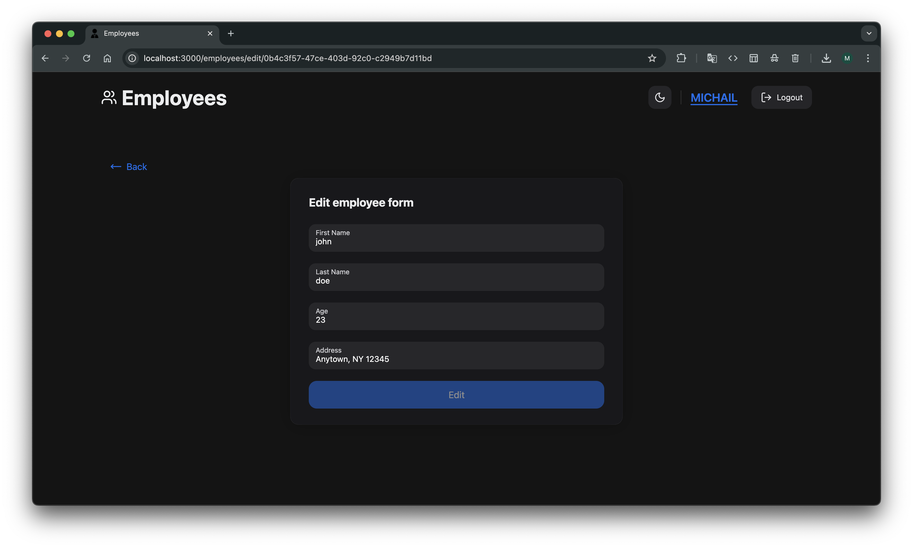
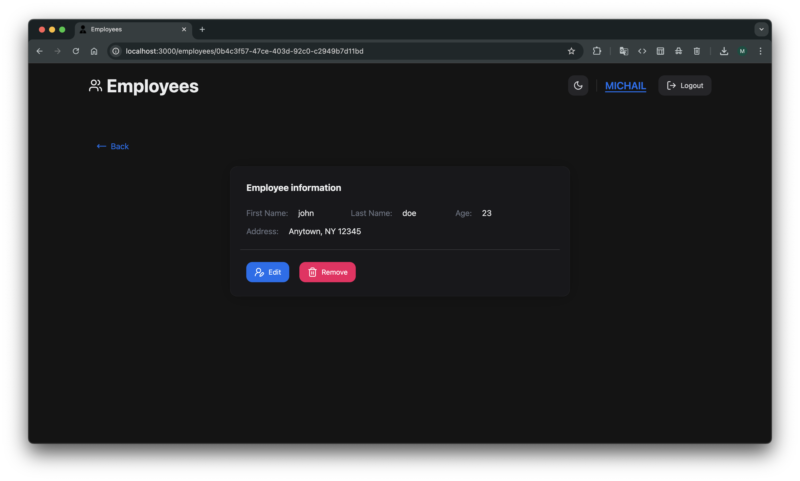

# 🧩 Fullstack Employees

A full-featured fullstack application for managing employees, built with **NestJS**, **Next.js**, **PostgreSQL**, **Docker**, and **RTK Query**.

## 📦 Tech Stack

- **Backend:** NestJS, PostgreSQL, Prisma ORM, JWT
- **Frontend:** Next.js, TypeScript, RTK Query, ShadCN/UI
- **DevOps:** Docker, Docker Compose
- **Authentication:** JWT (Access Token)

---

## 🚀 Quick Start

### 1. Clone the repository

```bash
git clone https://github.com/MishaDenisenko/fullstack-employees.git
cd fullstack-employees
```

### 2. Setup environment variables

Create .env file from example templates:

```bash
cp server/.env.example server/.env
```

Edit the values as needed

### 3. Run with Docker

```bash
docker-compose up --build
```

Make sure ports 8000 (backend) and 3000 (frontend) are free.

App will be available at:
•	Frontend: http://localhost:3000
•	Backend API: http://localhost:8000
•	PostgreSQL DB: localhost:5432 (default: postgres / postgres)

## 🛠️ Useful Commands

### Prisma

```bash
# Generate Prisma client
npx prisma generate

# Open Prisma Studio (GUI for DB)
npx prisma studio

# Apply schema to DB
npx prisma db push
```

### Backend

```bash
cd server
npm install
npm run start
```

### Frontend

```bash
cd client
npm install
npm run dev
```

## ✅ Features
- Registration / Login
- Protected routes
- Employees CRUD
- Auth check in frontend
- Token stored in localStorage

## 📷 Screenshots

### Authorization

### Home page

### Add page

### Edit page

### Employee details



